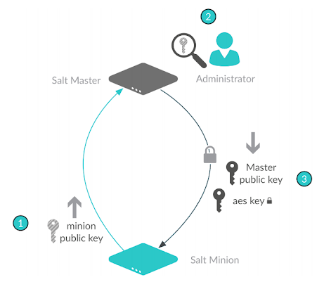

.. _accept-keys:

======================
Accept the minion keys
======================

The final step in the installation process is for the Salt master to accept the
Salt minion keys. Once the keys are accepted, the Salt master can issue commands
to the minion and receive inbound messages from the minion. Salt minions do not
receive data from the Salt master until the key is accepted.

.. Note::
    Before you can accept the minion keys, you must first install, configure,
    and start the Salt services. For more information, see:

    * :ref:`overview`
    * :ref:`configure-master-minion`
    * :ref:`start-salt-services`

About the Salt key exchange
===========================
For security, Salt uses key-based authentication.

Two types of keys are used in Salt:

* RSA
* AES

The RSA keys are the backbone to the authentication and encryption model used by
Salt. All Salt daemons run with unique RSA keys. The minions and master generate
RSA keys when they start for the first time, and then use them for PKI-based
authentication.

These keys are used to authenticate the AES key to the Salt master, providing
secure communication by encrypting data. Each minion presents a public key to
the Salt master. The key is then examined, compared, and explicitly accepted by
an administrator.

The master also sends a rotating AES key that is used to encrypt and decrypt
messages sent by the Salt master. The returned AES key is encrypted using the
public key initially sent by the Salt minion, and can therefore be decrypted
only by the same Salt minion.

The AES key is rotated in either of these conditions:

* Every 24 hours on the master
* When the master is restarted
* When a minion key deleted.

The key rotation allows the master to lock out minions that are not
authenticated and it allows system-wide communication encryption.

Managing keys
=============
Most minion management is handled through a client called ``salt-key`` that runs
on the Salt master. This client is used for managing which minions are available
to a master.

You can use the ``salt-key`` command to interface with the authentication system
to accept, reject, and otherwise manage keys.

Accepting keys
==============
When a new minion checks in, the key will wait in ``Unaccepted keys`` until it
is accepted.

Call ``salt-key`` to see the current state of key management:

.. code-block:: bash

    salt-key

Example response:

.. code-block:: bash

    Unaccepted Keys:
    db1
    Accepted Keys:
    web1
    web2
    Rejected:
    badguy

In this example, to accept keys, run:

.. code-block:: bash

    salt-key -a db1

If there are multiple keys to accept and are trusted, you can accept all at once:

.. code-block:: bash

    salt-key -A

.. Danger::
    A master that is open to the internet is considered a security
    vulnerability.

Deleting keys
=============
Keys can also be deleted singularly or in bulk. Because this is a permanent
action, running the command will give a [n/Y] prompt for confirmation.

Deleting a single key:

.. code-block:: bash

    salt-key -d web1

Example response:

.. code-block:: bash

    The following accepted key is set to be removed:
    web1
    [n/Y]

Deleting all keys:

.. code-block:: bash

    salt-key -D

Example response:

.. code-block:: bash

    The following keys are going to be deleted:
    web1
    web2
    [n/Y]

Deleting keys using a filter:

.. code-block:: bash

    salt-key -d 'web*'

Example response:

.. code-block:: bash

    The following keys are going to be deleted:
    web1
    web2
    [n/Y]

Automatically accept or reject keys
===================================
It is possible to automate key acceptance. One approach would be to enable the
``auto*accept: True`` setting in the master config file.

.. Danger::
    Automatically accepting keys is very dangerous. Auto accepting minions means
    anyone can set a minion to connect and gather data on the entire system or
    worse depending on master config settings.

    Be extremely cautious about automatically accepting all incoming keys from a
    Salt minion. Just because it is possible to auto-accept keys does not mean
    you should do it.

For more information, see:

* `The autoreject_file <https://docs.saltproject.io/en/latest/ref/configuration/master.html#autoreject-file>`_
* `Autoaccept minions from grains <https://docs.saltproject.io/en/latest/topics/tutorials/autoaccept_grains.html#tutorial-autoaccept-grains>`_

Reference: ``salt-key`` flags
=============================

.. list-table::
  :widths: 20 80
  :header-rows: 1

  * - Flag
    - Description

  * - ``-a <minion ID>``
    - Accepts a specific minion's key. The ``-a`` flag needs to be followed by
      an argument that includes the ID of the minion key that you want to
      accept.

  * - ``-A``
    - Accepts all keys.

  * - ``-d <minion_id>``
    - Deletes a specific minion's key. The ``-d`` flag needs to be followed by
      an argument that includes the ID of the minion key that you want to
      delete.

  * - ``-L``
    - Lists all minion IDs.

Next steps
==========
After accepting the Salt minion keys, verify that your installation of Salt was
successful. See :ref:`verify-install` for more information.
