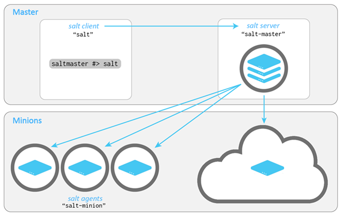

.. _check-system-requirements:

=========================
Check system requirements
=========================

To check if your operating system is supported, see:

* :ref:`salt-supported-operating-systems`
* :ref:`salt-version-support-lifecycle`

.. include:: _includes/supported-os-concepts.rst

If you are first starting out with Salt, don't worry too much about the need
to plan your system architecture. You can add Salt components and modify
your configuration later without reinstalling anything.
