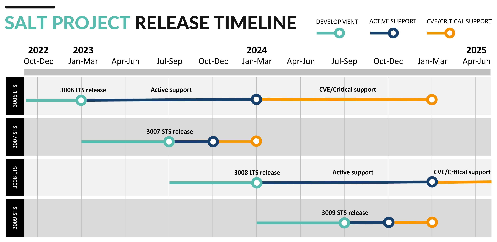

.. _salt-version-support-lifecycle:

==============================
Salt version support lifecycle
==============================

Together with the :ref:`salt-supported-operating-systems` guidelines, this
document is intended to clearly define how long a particular version of Salt
will receive official packages, testing, and technical support.

Version support lifecycle
=========================

.. list-table::
  :widths: 20 25 25 30
  :align: center
  :header-rows: 1
  :stub-columns: 1
  :class: slim

  * - Salt version
    - Release date
    - `Active support`_ ends
    - `CVE and critical support`_ ends

  * - 3006 LTS
    - TBD
    - TBD
    - TBD

See `Older version support lifecycle`_ for versions of Salt older than 3006.

LTS/STS release and support policy
==================================
Beginning with the 3006 release of Salt, the Salt Project will follow an LTS/STS
release strategy. Under this strategy, the Salt Project will release one LTS
(long-term support) release of Salt per year and one STS (short-term support)
release each year. The LTS release will receive bug fix releases for a longer
period of time than STS releases.

The purpose of the LTS release is to provide users with a stable version of Salt
for a longer period (2 years). The purpose of the STS release is to provide a
feature release to users who need or prefer access to the latest features in
between LTS releases.

.. list-table::
  :widths: 30 35 35
  :header-rows: 1
  :stub-columns: 1

  * -
    - LTS release
    - STS release

  * - Release schedule
    -  * Released once a year, usually in the first 4 months of the calendar
         year
       * 1-2 release candidates in the months leading up to the release
       * Point releases every 3 months after the GA release
    -  * Released once a year around the midpoint the year

  * - Support schedule
    -  * Active support for 1 full year, including rolling updates of bug fixes
         every quarter
       * CVE and critical fixes support for an additional year
    -  * Active support for 3 months
       * CVE and critical fixes support for an additional 3 months

  * - Development schedule
    - Features developed in the 6 months prior to release
    - Features developed in the 6 months prior to release

  * - Use case
    - Best for users who:

      * Need or prefer a stable, thoroughly tested and well-supported release
      * Prefer stable releases over access to the latest features
      * Require longer time periods to plan and implement Salt infrastructure
        upgrades
    - Best for users who:

      * Need or prefer access to new features in between LTS releases
      * Are comfortable assuming a small amount of risk as a trade-off for
        access to the latest features

The following graphic shows an example of the LTS/STS release strategy timeline
for two years of the development and release cycle:

         that is actively supported for a full year and then has CVE and
         Critical support for an additional year. The graphic also shows an STS
         release that occurs between July and September that is actively
         supported for 3 months and then has CVE/Critical support for 3
         additional months.

Support level definitions
=========================

Active support
--------------
**Active support** is defined as:

* The Salt Project will issue regular point releases with critical bug fixes.
* Improved software functionality may be provided at the discretion of the
  project.
* Point releases will include the content of previously released updates.
* The focus of point releases will be high and critical bugs.

CVE and critical support
------------------------
**CVE and critical support** is defined as:

* The Salt Project may release point releases with fixes for selected CVEs.
* Fixes in newer branches will not be back ported.
* The focus of point releases will be critical CVEs and breaking fixes that
  are caused by CVE fixes.

Older version support lifecycle
===============================
The following table lists the support lifecycle for versions of Salt prior to
the 3006 version:

.. list-table::
  :widths: 15 20 20 20 25
  :align: center
  :header-rows: 1
  :stub-columns: 1
  :class: slim

  * - Salt version
    - `Phase 1 support`_ ends
    - `Phase 2 support`_ ends
    - `Phase 3 support`_ ends
    - `Extended life support`_ ends

  * - 3005
    - Feb 25, 2023
    - Aug 25, 2023
    - Feb 25, 2024
    - Feb 25, 2025

  * - 3004
    - Apr 18, 2022
    - Oct 18, 2022
    - Apr 18, 2023
    - Apr 18, 2024

  * - 3003
    - Sep 30, 2021
    - Mar 31, 2022
    - Sep 30, 2022
    - Sep 30, 2023

  * - 3002
    - Apr 21, 2021
    - Oct 21, 2021
    - Apr 21, 2022
    - Apr 21, 2023

  * - 3001
    - Dec 31, 2020
    - Jun 30, 2021
    - Dec 31, 2021
    - Dec 31, 2022

  * - 3000
    - Aug 31, 2020
    - Feb 28, 2021
    - Aug 31, 2021
    - Aug 31, 2022

  * - 2019.2
    - Sep 30, 2019
    - Mar 31, 2020
    - Sep 30, 2020
    - Sep 30, 2021

  * - 2018.3
    - Oct 31, 2018
    - Apr 30, 2019
    - Oct 31, 2019
    - Oct 31, 2020

  * - 2017.7
    - Jan 31, 2018
    - Jun 30, 2018
    - Aug 30, 2019
    - Dec 31, 2019

  * - 2016.3
    - Nov 30, 2016
    - May 31, 2017
    - Nov 30, 2017
    - Nov 30, 2018

  * - 2015.8
    - Mar 31, 2016
    - Sep 30, 2016
    - Mar 31, 2017
    - Mar 31, 2018

  * - 2015.5
    - Nov 31, 2015
    - May 31, 2016
    - Nov 30, 2016
    - Nov 30, 2017

  * - 2014.7
    - May 31, 2015
    - Nov 30, 2015
    - May 31, 2016
    - May 31, 2017

Older version support level definitions
=======================================

Phase 1 support
---------------
Regular point release support

During phase 1:

* The Salt Project will issue regular point releases with critical bug fixes.
* Improved software functionality may be provided at the discretion of the
  project.
* Point releases will include the content of previously released updates.
* The focus of phase 1 releases will be high and critical bugs.

Phase 2 support
---------------
On-demand support

During phase 2:

* The Salt Project may release point releases with bug fixes as requested by
  VMware customers.
* Point releases will include the content of previously released updates.
* The focus of phase 2 releases will be high or critical bugs.

Phase 3 support
---------------
CVE support

During phase 3:

* The Salt Project will release point releases with fixes for selected, critical
  CVEs.
* Fixes in newer branches will not be back ported.

Extended life support
---------------------

During extended life support:

* The Salt Project will not release any point releases.
* Users will still have access to archived documentation.
* The Salt Project will provide ongoing best-effort technical support for
  customers on existing installations.
* No bug fixes, security fixes, improved functionality, or root-cause analysis
  will be provided.

Phase details
-------------

.. list-table::
  :widths: 35 15 15 15 20
  :align: center
  :header-rows: 1
  :stub-columns: 1
  :class: slim

  * -
    - Phase 1 support (6 months)
    - Phase 2 support (6 months)
    - Phase 3 support (6 months)
    - Extended life support (12 months)

  * - Access to documentation
    - Yes
    - Yes
    - Yes
    - Yes

  * - Technical support [#f1]_
    - Yes
    - Yes
    - Yes
    - Yes (best effort)

  * - Access to customer portal [#f2]_
    - Yes
    - Yes
    - Yes
    -

  * - CVE fixes
    - Yes
    - Yes
    - Yes
    -

  * - Point release with bug fixes
    - Yes
    - Yes
    -
    -

  * - Software enhancements
    - Yes
    -
    -
    -

.. [#f1] For VMware customers only.

.. [#f2] For VMware customers only.
